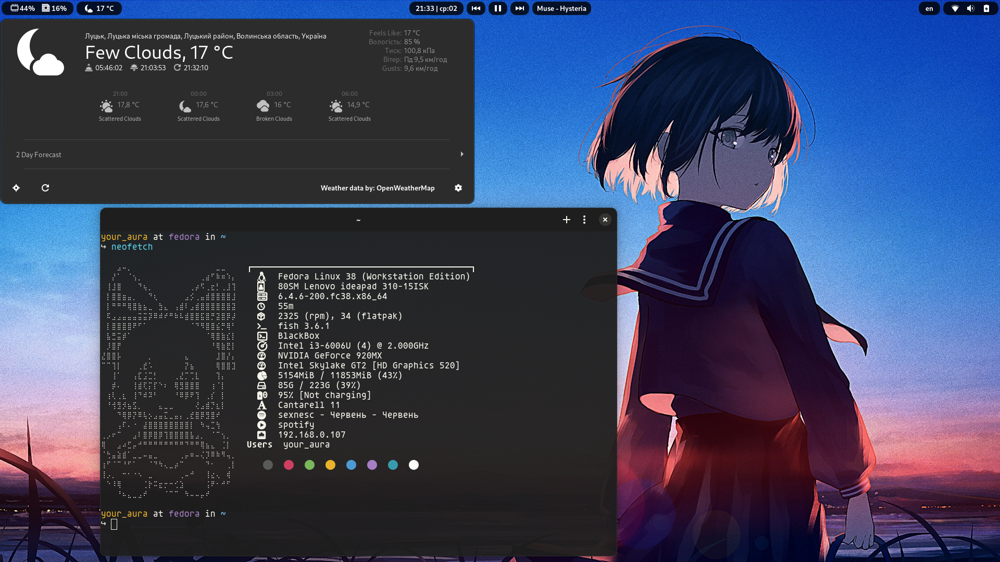
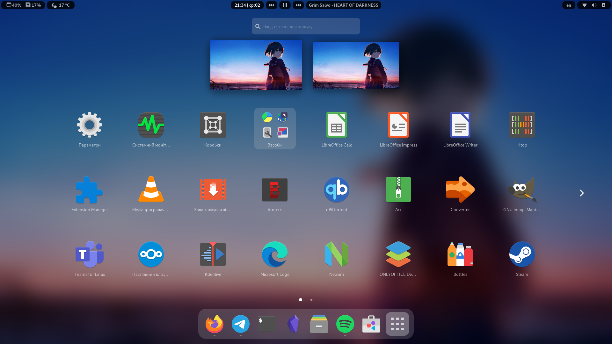
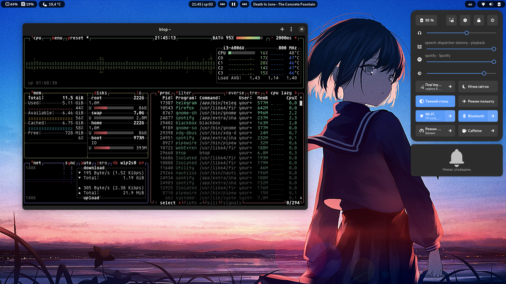

# first_aura_rice
And then I was like, I've made my first rice. You can put this beauty in your gnome
# Screenshot

# What I use

Linux distribution: Fedora 38

Gnome version: 44

Theme: Colloid-dark

Iconset: Papirus-dark

# Extensions
- Aylur`s Widgets
- Blur my Shell
- Caffeine
- Just Perfection
- OpenWeather
- User Themes
- Virals

# Wallpaper

